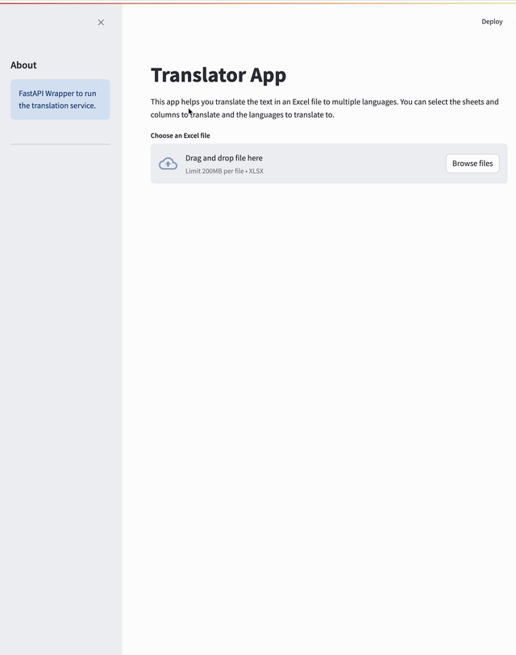

# Translator App

This project is a translator. It allows users to upload an Excel file, select sheets and columns to translate, and specify target languages for translation. The translations are performed using OpenAI's GPT models. The model is configurable, allowing it to run in parallel to speed up the process. You can set these parameters in the `params.yaml` file.


## Table of Contents

- [Installation](#installation)
- [Usage](#usage)
- [Streamlit App](#streamlit-app)
- [FastAPI Backend](#fastapi-backend)

## Installation

1. Clone the repository:
    ```bash
    git clone git@github.com:fuel50/translation-studio.git 
    cd skill-translation-api
    ```

For dependency management, this project uses `pyenv` to set the specific version of Python and `poetry` to manage dependencies.

2. Install `pyenv`:
    ```bash
    brew update
    brew install pyenv
    ```

3. Install `poetry`:
    ```bash
    curl -sSL https://install.python-poetry.org | python3 -
    ```

4. After the initial installation, choose a version of Python to run (currently 3.11) and initialize the virtual environment with the project dependencies:
    ```bash
    pyenv install 3.11
    pyenv local 3.11
    poetry env use 3.11
    poetry install
    poetry shell
    ```

## Usage

1. Add your OpenAI API key by creating a `llm_config.yaml` file from the `llm_config.yaml.example` file. Refer to this guide for obtaining your OpenAI API key: [OpenAI API Key Guide](https://help.openai.com/en/articles/4936850-where-do-i-find-my-openai-api-key).

2. Open a terminal and run the code below:
    ```bash
    chmod +x run_app.sh && ./run_app.sh
    ```
    Open your web browser and go to `http://localhost:8501`.

Alternatively, you can run the backend and frontend with the following commands:

1. Start the FastAPI backend:
    ```bash
    uvicorn src.main:app
    ```

2. Run the Streamlit app:
    ```bash
    streamlit run src/app/app.py
    ```

3. Open your web browser and go to `http://localhost:8501`.

The created output files can be found in the `translated_files` directory.

## Streamlit App

The Streamlit app provides an interactive interface for uploading the Excel file, selecting sheets and columns, and specifying target languages for translation.


### Key Features

- **File Upload**: Upload an Excel file containing skill descriptions.
- **Sheet and Column Selection**: Select the sheets and columns to translate.
- **Language Selection**: Choose target languages for translation.
- **Translation**: Send the selected data to the FastAPI backend for translation.
- **Download**: Download the translated Excel file.

## FastAPI Backend

The FastAPI backend handles the translation requests from the Streamlit app. It processes the uploaded file, performs translations using OpenAI's GPT models, and returns the translated file.

### Key Endpoints

- **POST /translate/**: Handles the translation of skill descriptions.


